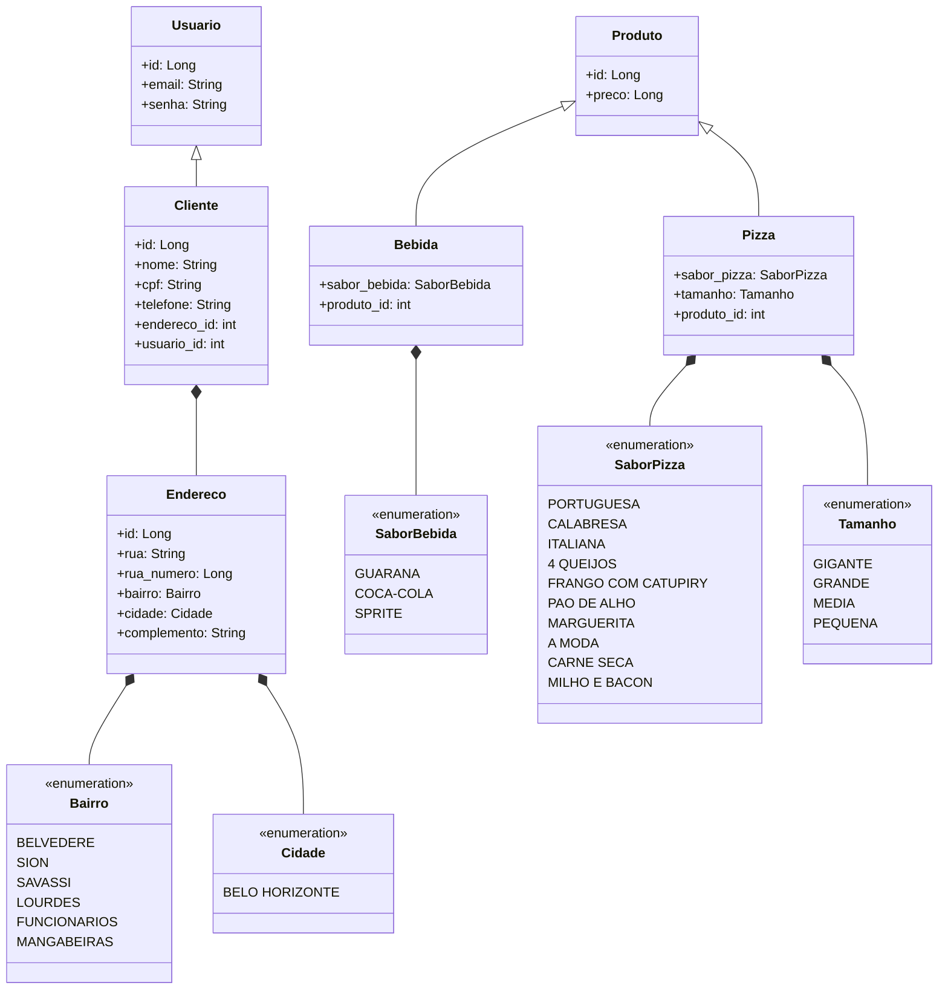
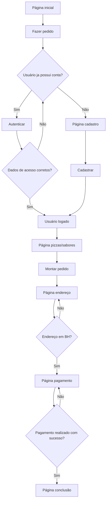

# Laboratório de Engenharia de Software I - Grupo 4 - Trabalho 1 BACKEND
Neste trabalho prático, o grupo deverá criar uma aplicação Web para realizar a
entrega de pedidos para uma pizzaria. Utilizaremos em nossa aplicação Spring Boot Java 11 para backend, React para frontend e MySQL para o banco de dados.

## Instalação

Use o seguinte comando para importar o backend à sua máquina:

```bash
git clone https://github.com/Henrique-coelho/engsoftware-pizzaria-backend.git
```

E o seguinte comando para importar o frontend à sua máquina:

```bash
git clone https://github.com/MyLittleFoxxie/engsoftware-pizzaria-frontend.git
```

Lembre de realizar a instalação do JDK 11 e node.js em sua máquina!

Para instalar o banco de dados MySQL que utilizaremos, siga os seguintes passos:
1. Baixe e instale o software [XAMPP](https://www.apachefriends.org/download.html).
2. Inicie os módulos de Apache e MySQL.
3. Clique em "Admin" para abir o banco de dados em seu navegador.
3. Ao lado esquerdo da página do navegador, crie um novo banco de dados denominado "engenhariasoftware".
4. Pronto!

O projeto não compilará caso não suba o banco de dados MySQL.

## Startup

1. Suba o banco de dados MySQL pelo software XAMPP. 
2. Suba o backend Java pelo Maven.
3. Suba o frontend pelo comando "npm start".


## Diagrama de Classes




## Flowchart




## Contribuição
Pull requests são bem-vindas.

