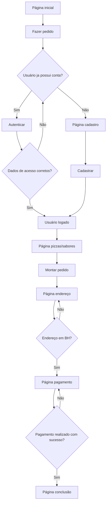
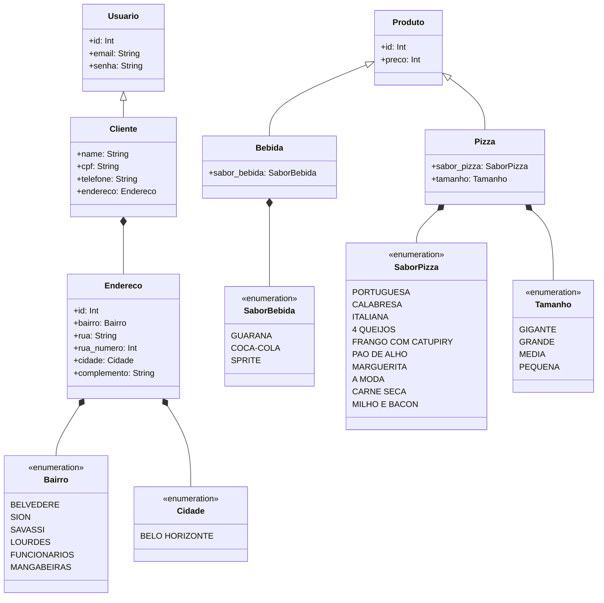

# Grupo 4 - Trabalho 1 – Laboratório de Engenharia de Software I

Neste trabalho prático, o grupo deverá criar uma aplicação Web para realizar a
entrega de pedidos para uma pizzaria. Utilizaremos em nossa aplicação Spring Boot Java 18 para backend, React para frontend e MySQL para o banco de dados.

## Instalação

Use o seguinte comando para importar o projeto a sua maquina:

```bash
git clone https://github.com/Henrique-coelho/engsoftware-pizzaria-backend.git
```

## URL

[URL do site gerado](https://www.google.com/search?q=oi&rlz=1C1FCXM_pt-PTBR997BR997&oq=oi&aqs=chrome..69i57j46i199i291i512j0i67l2j0i512l6.368j0j7&sourceid=chrome&ie=UTF-8)


## Flowchart



## Diagrama de Classes




## Contribuição
Pull requests são bem-vindas.

