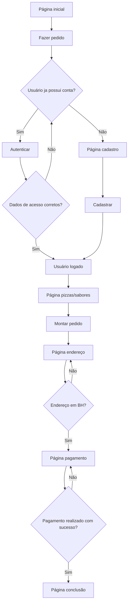
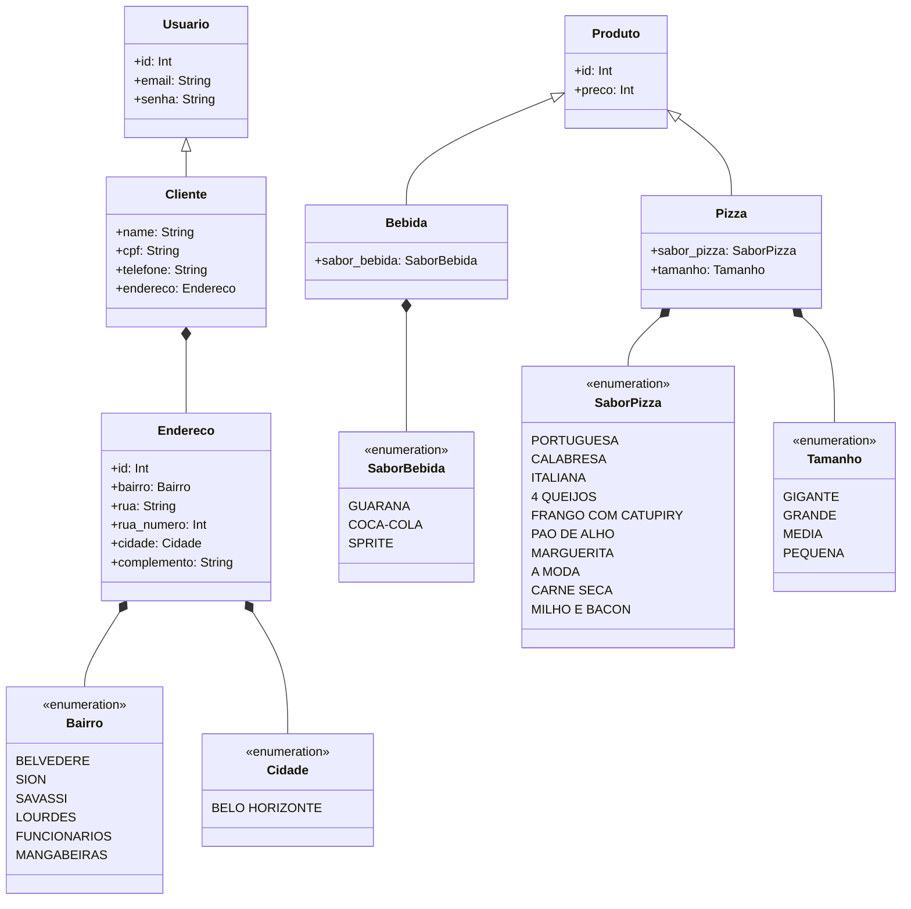

# Laboratório de Engenharia de Software I - Grupo 4 - Trabalho 1 BACKEND
Neste trabalho prático, o grupo deverá criar uma aplicação Web para realizar a
entrega de pedidos para uma pizzaria. Utilizaremos em nossa aplicação Spring Boot Java 11 para backend, React para frontend e MySQL para o banco de dados.

## Startup

Primeiramente, suba o banco de dados MySQL pelo software XAMPP, sua instalação está descrita na próxima seção. Segundamente, suba o backend Java pelo Maven.
Finalmente, suba o front-end pelo comando "npm start".

## Instalação

Use o seguinte comando para importar o back-end à sua máquina:

```bash
git clone https://github.com/Henrique-coelho/engsoftware-pizzaria-backend.git
```

E o seguinte comando para importar o front-end à sua máquina:

```bash
git clone https://github.com/MyLittleFoxxie/engsoftware-pizzaria-frontend.git
```

Para instalar o banco de dados que utilizaremos, faça o download do software XAMPP. Após sua instalação inicie os módulos de Apache e MySQL, clique em "Admin" para abir o banco de dados em seu browser e crie um novo banco de dados denominado "engenhariasoftware". Agora suba sua aplicação Java que todas as tabelas necesárias serão criadas automaticamente.

O projeto não compilará caso não suba o banco de dados MySQL.

## URL

[URL do site gerado](http://localhost:3000/)


## Flowchart



## Diagrama de Classes




## Contribuição
Pull requests são bem-vindas.

